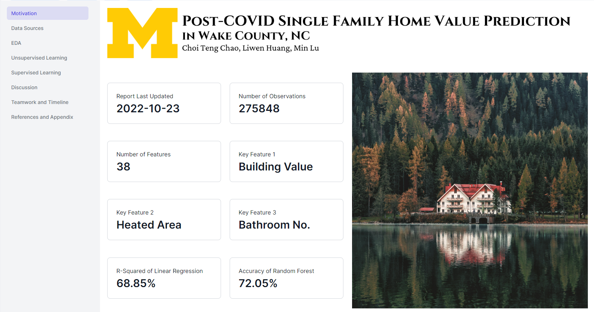

# Post-COVID Single Family Home Value Prediction in Wake County, NC

This project generates four machine learning models, two supervised learning models, and two unsupervised learning models to determine the impacts of COVID on the residential real estate market and to predict the value of single-family homes in Wake County, North Carolina (NC). This paper describes a deeper understanding of the relationships among the housing market, house utilities, COVID features, and macroeconomic indicators. 

## Authors

- [@alisongh](https://github.com/alisongh)
- [@dingdingmammy](https://github.com/dingdingmammy)
- [@mmminlu](https://github.com/mmminlu)

## Project Report

[Project Report](https://cloud.datapane.com/reports/VkGLe2A/post-covid-single-family-home-value-prediction-in-wake-county-nc/)
## Screenshots

## Roadmap

- Team Assembled
- Proposal Drafted
- Proposal Revised
- Completed Data Cleaning and Exploratory Data Analysis
- Completed Modeling
- Completed Final Report and Porfolio

## Support

For support, email liwenh@umich.edu, choichao@umich.edu or lumin@umich.edu.

